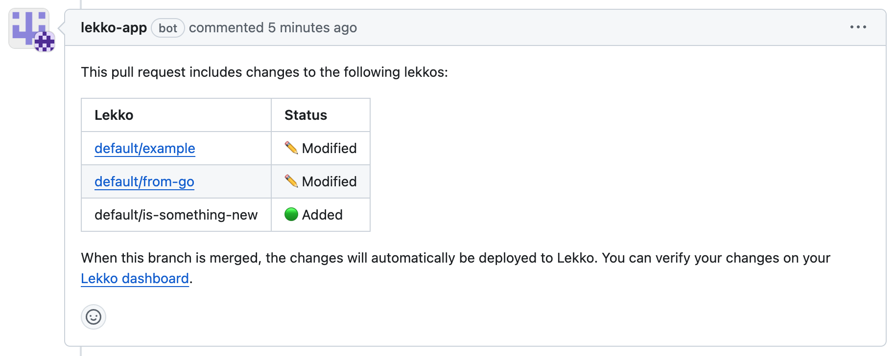
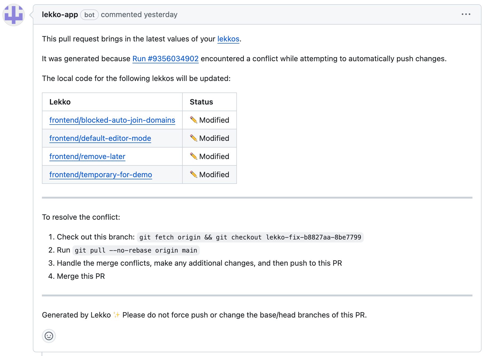

# Lekko Push Action

This GitHub Action enables changes to Lekko functions in your projects to be pushed to Lekko automatically. It also lets you know if there are any relevant changes in your pull requests that will be pushed via the Lekko GitHub App.



## Usage

Example `.github/workflows/ci.yaml` for a Node project:

> [!IMPORTANT]
> This Action should be configured to **only** trigger on `pull_request` and `push` events on your repository's default branch, as shown below.
>
> To learn more about GitHub events, please refer to their [docs](https://docs.github.com/en/actions/using-workflows/events-that-trigger-workflows).

```yaml
name: ci
on:
  # Run this workflow when pull requests are opened or updated against main
  pull_request:
    branches:
      - main
  # Run this workflow when a commit is pushed to main (e.g. a pull request is merged)
  push:
    branches:
      - main
permissions:
  contents: read
jobs:
  build:
    runs-on: ubuntu-latest
    steps:
      # It is required to checkout and install dependencies for your project before the Lekko push step
      - name: Checkout project
        uses: actions/checkout@v4
      - name: Set up language-specific environment
        uses: actions/setup-node@v4
        with:
          node-version: 18
      - name: Install project dependencies
        run: npm install
      - name: Other CI steps
        run: |
          npm run build
          npm run test
      # This is where Lekko comes in
      - uses: lekkodev/push-action@v1
        with:
          api_key: ${{ secrets.LEKKO_API_KEY }}
```

## Configuration

### `.lekko`

`lekkodev/push-action` depends on a `.lekko` file located in the root directory of your repository.

Example:

```yaml
version: v1
repository: your-org/lekko-repository # Your Lekko repository
lekko_path: src/lekko # Path to Lekko function files in project
```

### Inputs

`lekkodev/push-action` takes the following inputs:

| Input     | Description                                                                                   | Required |
| --------- | --------------------------------------------------------------------------------------------- | -------- |
| api_key   | Your Lekko API key for the team/repository.                                                   | Y        |
| team_name | Your Lekko team name. Only required if your team name is different from your GitHub org name. | N        |

For the `api_key` input, it's recommended to store and read the value as an organization or repository [secret](https://docs.github.com/en/codespaces/managing-codespaces-for-your-organization/managing-development-environment-secrets-for-your-repository-or-organization), as shown in the above example.

## Conflict resolution

If someone makes changes to lekkos from outside your code (e.g. through the Lekko dashboard), it's possible that an attempted code change will result in a conflict at the destination when it's merged.

If there are any conflicts when pushing your changes, this Action will automatically open a pull request to help you resolve them.


